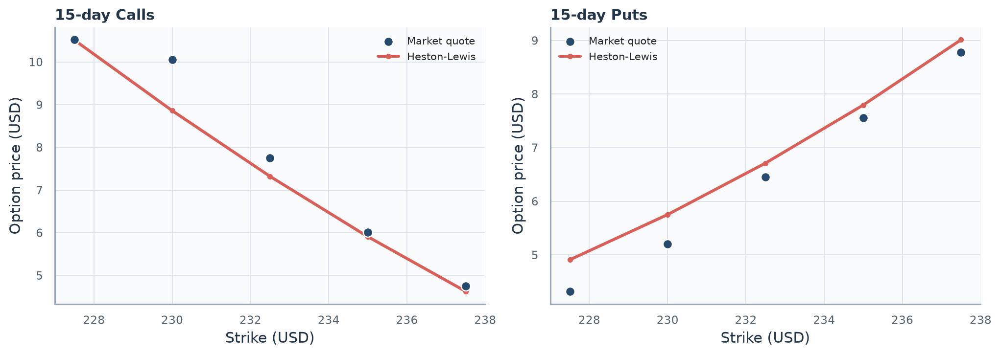
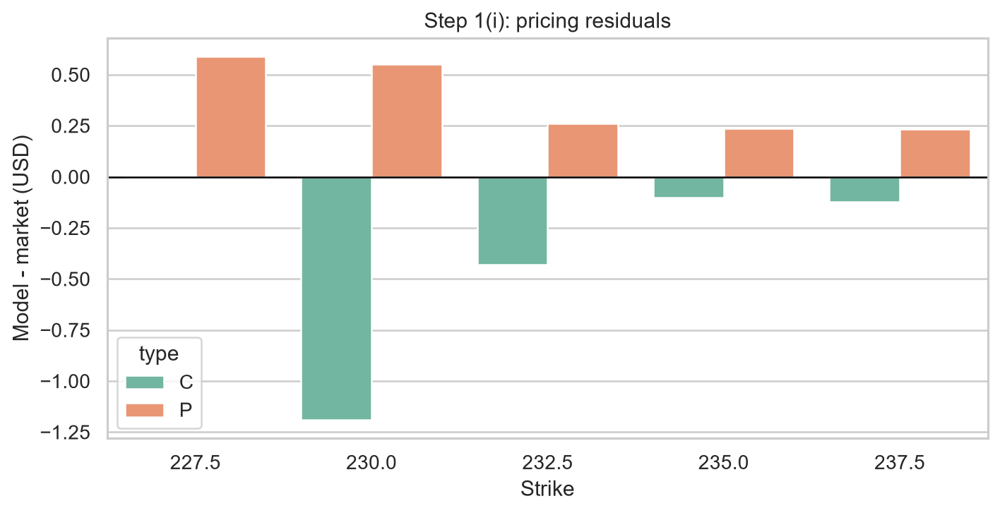
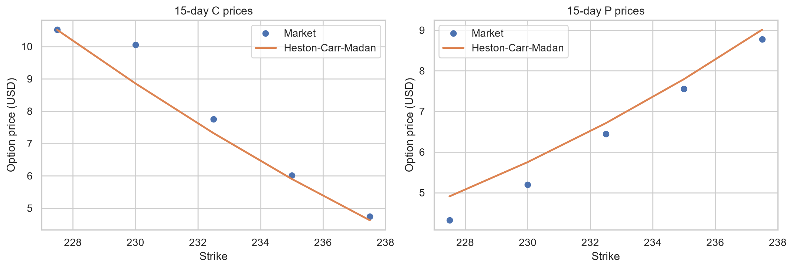
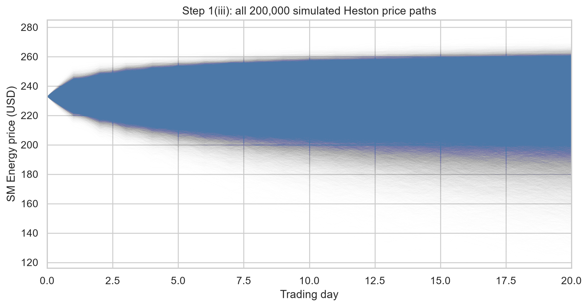
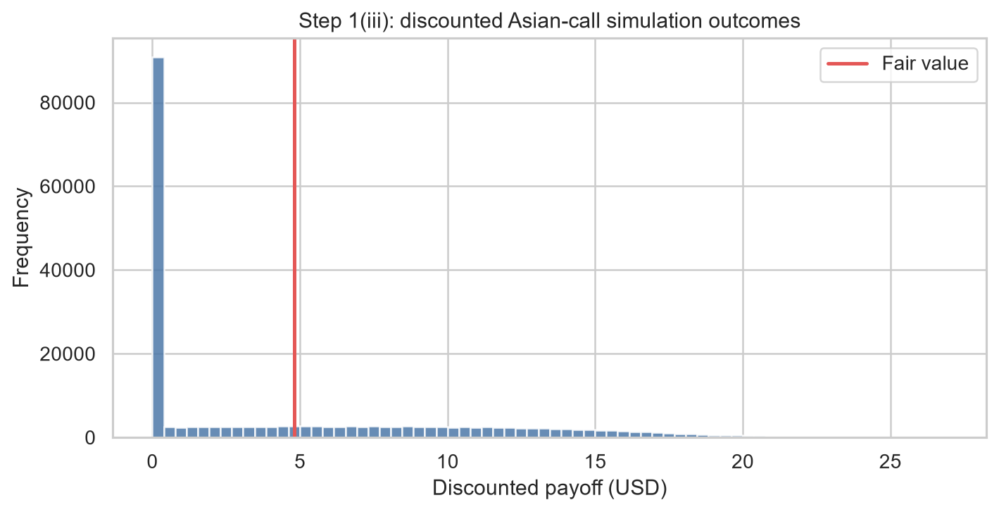
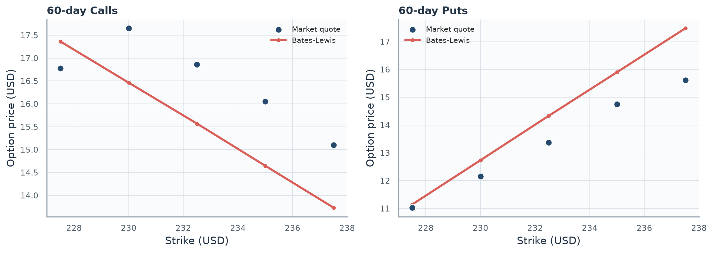
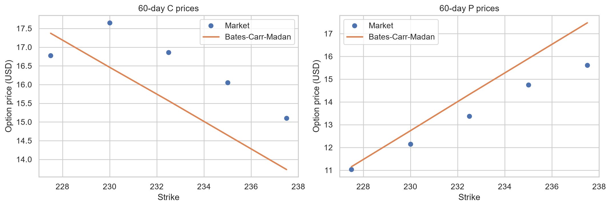
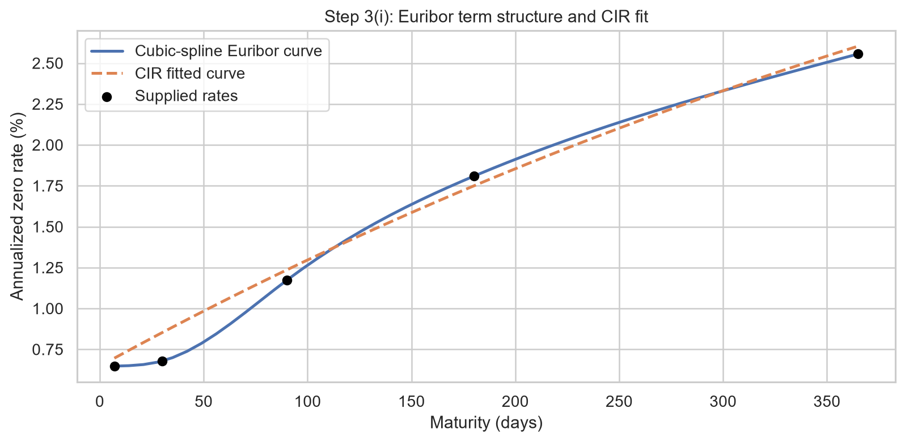
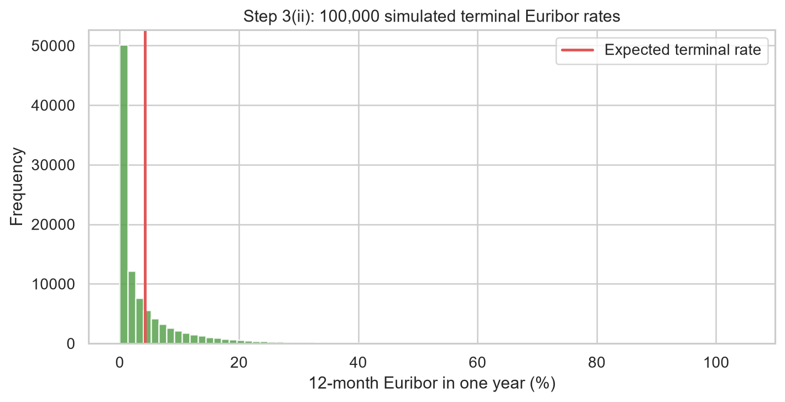

# MScFE 622 - Stochastic Modeling: Group Work Project 1

## Executive summary

This companion presents the assumptions, results, interpretations, and figures for all project questions. SM Energy spot is $232.90; the annual risk-free rate is 1.50%; one year is 250 trading days; and no dividend yield is assumed.

## Step 1 - 15-day derivative

### 1(i) Heston calibration using Lewis (2001)

Heston represents equity returns with a randomly changing, mean-reverting variance process that can reproduce volatility clustering and implied-volatility skew. Lewis converts its characteristic function into a one-dimensional Fourier pricing integral.

The 15-day calls and puts were fitted jointly using the Heston specification and Lewis representation (Heston 327-343; Lewis), with unweighted USD price MSE as required by the project brief (WorldQuant University 1-2). The fitted parameters are kappa=2.2032, theta=0.0010, sigma=1.2733, rho=-0.9444, and initial variance=0.1084. MSE is 0.2458 and RMSE is $0.4958.

The input quotes have a put-call parity RMSE of $0.9068; an arbitrage-consistent fit cannot make all residuals zero. Short maturity also weakens identification of long-run variance and mean reversion.

Initial variance implies 32.93% annualized volatility and rho=-0.9444 indicates a strong leverage effect. Theta is at its lower bound and the Feller diagnostic is -1.6170; the parameter vector should therefore be treated as a short-horizon fit rather than a long-run forecast.

### 1(ii) Carr-Madan comparison

Carr-Madan damps the option-price function so it can be evaluated through an integrable Fourier transform, providing an independent pricing and calibration route for the same Heston dynamics.

The damped transform follows Carr and Madan (61-73). Its MSE is 0.2458, compared with 0.2458 for Lewis. Fitted prices and numerical stability are the meaningful comparison.

Kappa changes from 2.2032 under Lewis to 0.0504 under Carr-Madan even though the losses are identical to four decimals. This is consistent with weak short-maturity identification: the two numerical formulas agree on prices, while the optimizer can move along a flat parameter direction.

### 1(iii) 20-day ATM Asian call

The arithmetic-average Asian payoff reduces dependence on a single terminal stock price. Monte Carlo simulation is required because the payoff depends on the complete daily path.

Today's spot is included in the arithmetic average, following the project instructions (WorldQuant University 1-2). Across 200,000 risk-neutral scenarios, fair value is $4.8177 (standard error $0.0130), with a 95% estimator interval of $4.7922 to $4.8432. The 4% fee produces a client price of $5.0104.

The standard error is 0.27% of fair value, so simulation noise is small relative to calibration risk. The interval measures estimator precision and is not a guaranteed payoff range for the client.

## Step 2 - 60-day derivative

### 2(i) Bates calibration using Lewis

Bates extends Heston with random discontinuous price jumps, allowing the model to represent rare abrupt moves in addition to ordinary stochastic-volatility dynamics.

The 60-day jump-diffusion calibration follows Bates (69-107) and has MSE 1.3324 and RMSE $1.1543.

The call-put pairs have parity RMSE $2.2533. Rho is at its upper bound, theta and initial variance are at lower bounds, and jump volatility is at its lower bound. These boundary estimates and a Feller diagnostic of -0.0228 show that the eight parameters are weakly identified by this small, internally inconsistent cross-section.

### 2(ii) Carr-Madan comparison

This specification retains the Bates jump and variance dynamics but uses the Carr-Madan transform as a numerical cross-check of Lewis pricing.

The matching Carr-Madan calibration follows Carr and Madan (61-73) and has MSE 1.3335. The comparison is based on fitted-price errors and numerical stability.

Jump intensity and mean jump size remain stable across methods, but kappa changes from 0.0114 to 14.9006. Nearly equal loss with very different mean reversion indicates a flat or multi-modal objective; fitted prices are more reliable than parameter equality.

### 2(iii) 70-day 95%-moneyness put

The project specifies a strike of 95% of spot (WorldQuant University 3), giving $221.25. Fair value is $8.8187 and the price after the 4% fee is $9.1715.

The 70-day maturity is a ten-trading-day extrapolation beyond the calibration sample. The extension is modest, but the boundary-sensitive Bates estimates make calibration risk more material than the difference between the two Fourier integration methods.

## Step 3 - Euribor rates

### 3(i) CIR calibration

CIR models a non-negative, mean-reverting short rate and connects its parameters to the Euribor curve through closed-form zero-coupon bond prices.

The supplied curve contains 0.648% (1 week), 0.679% (1 month), 1.173% (3 months), 1.809% (6 months), and 2.556% (12 months). Weekly interpolation follows the project brief (WorldQuant University 3-4), and the rate model follows Cox, Ingersoll, and Ross (385-407). The fitted values are a=0.7525, b=0.0742, eta=0.5638; MSE is 0.00000062.

Mean reversion implies a half-life of 0.92 years, while the long-run rate 7.4170% lies above current 12-month Euribor. Curve RMSE is 7.90 basis points, but the Feller diagnostic -0.2063 is negative, so the process can reach zero and the broad dynamics remain uncertain.

### 3(ii) One-year rate scenarios

Daily CIR simulation turns the calibrated rate dynamics into a one-year distribution, supporting an expected-rate estimate and an explicit measure of rate uncertainty.

Following the required simulation size (WorldQuant University 4), 100,000 daily scenarios give an expected terminal 12-month Euribor of 4.2289%; the 95% range is 0.0000% to 25.0856%. Higher expected rates increase discounting of future positive cash flows and generally lower present values, all else equal.

The expected rate is 167.3 basis points above today's 12-month quote. The distribution is strongly right-skewed: the lower endpoint is pinned at zero while the upper tail reaches high rates. Product effects are not universal because rates influence both discounting and risk-neutral drift; the CIR short rate is used here as a proxy for 12-month Euribor rather than a full multi-curve tenor model.

## Step 4 - Submission checklist

The analytical material, figures, and references are organized for the required report and archive. The presentation export suppresses inputs while retaining explanations, tables, and figures.

## Works Cited

- Bates, David S. "Jumps and Stochastic Volatility: Exchange Rate Processes Implicit in Deutsche Mark Options." The Review of Financial Studies, vol. 9, no. 1, 1996, pp. 69-107. https://doi.org/10.1093/rfs/9.1.69.

- Carr, Peter, and Dilip B. Madan. "Option Valuation Using the Fast Fourier Transform." The Journal of Computational Finance, vol. 2, no. 4, 1999, pp. 61-73.

- Cox, John C., Jonathan E. Ingersoll, Jr., and Stephen A. Ross. "A Theory of the Term Structure of Interest Rates." Econometrica, vol. 53, no. 2, 1985, pp. 385-407. https://doi.org/10.2307/1911242.

- Heston, Steven L. "A Closed-Form Solution for Options with Stochastic Volatility with Applications to Bond and Currency Options." The Review of Financial Studies, vol. 6, no. 2, 1993, pp. 327-343. https://doi.org/10.1093/rfs/6.2.327.

- Lewis, Alan L. "A Simple Option Formula for General Jump-Diffusion and Other Exponential Levy Processes." SSRN, 2001, https://ssrn.com/abstract=282110.

- WorldQuant University. MScFE 622 Stochastic Modeling: Group Work Project 1. 2022. Course handout.
